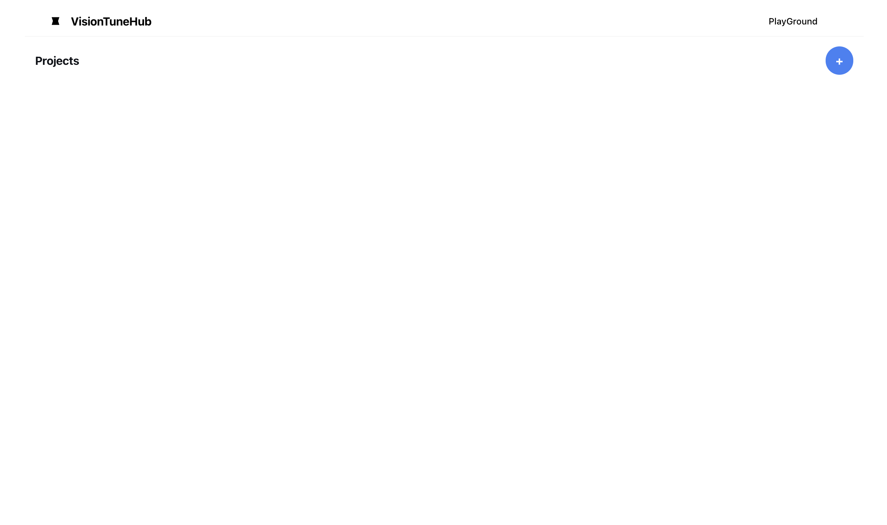

# VisionTuneHub
A Docker application for creating datasets to fine-tune OpenAI's Vision model.

## How to Use

### 1. Rename `.env_template` to `.env`
Copy the provided `.env_template` file and rename it to `.env` to set up your environment variables.

### 2. Edit the `.env` File
Update the `.env` file with the following configuration:

```env
# Configure the URLs for the frontend and backend
BACKEND_HOST=0.0.0.0
BACKEND_PORT=8080
FRONTEND_HOST=0.0.0.0
FRONTEND_PORT=3000

# Backend URL for the frontend to use
REACT_APP_BACKEND_URL=http://${BACKEND_HOST}:${BACKEND_PORT}
```
### 3. Start Docker
Run the following command to build and start the application:

```sh
docker-compose up --build
```
## Using the Application UI
After starting the application, access the frontend URL to open the main interface. The interface provides the following features:

### Main Page
Upon accessing the frontend URL, the following page will appear:



**Create a New Project**: Click the `+` button in the top-right corner to start a new project.

**Playground**: Navigate to the playground menu in the top bar to test models in the playground.
### Annotation
Input the necessary details for annotation.

Press `Shift + Enter` to confirm the annotation and move to the next one.
### Dataset Download
After completing the annotations, click the `Download` button in the menu bar to download the dataset.
### Fine-Tuning
Click the `Finetune` button in the menu bar to navigate to OpenAI's official fine-tuning page and proceed with the fine-tuning process.

Enjoy using VisionTuneHub for efficient dataset creation and fine-tuning of Vision models!